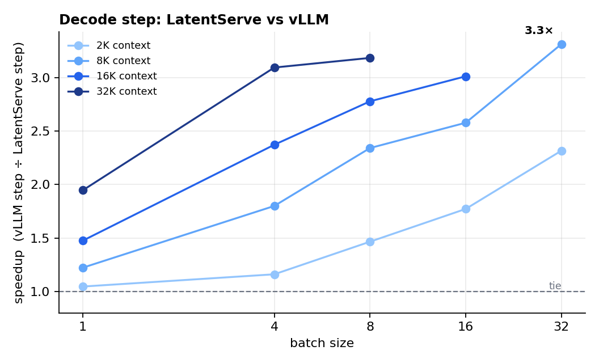
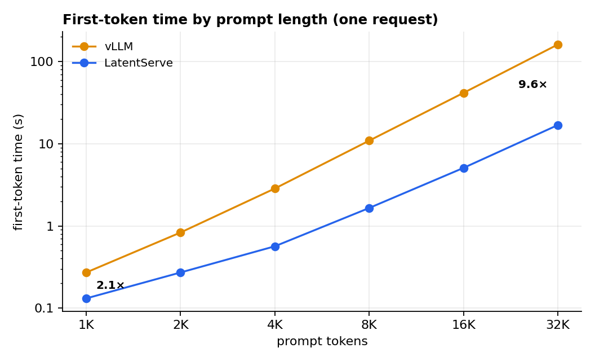
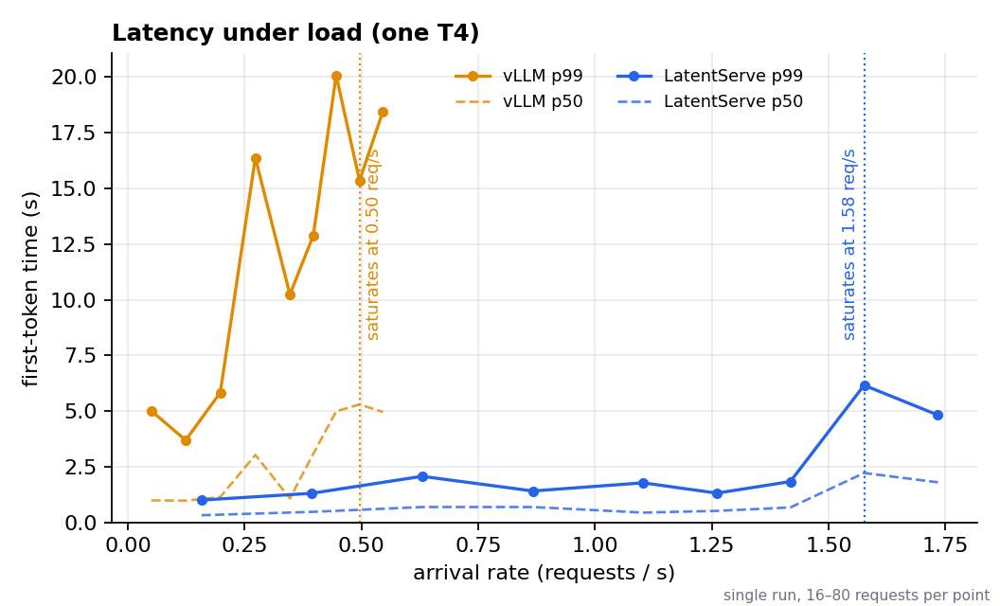
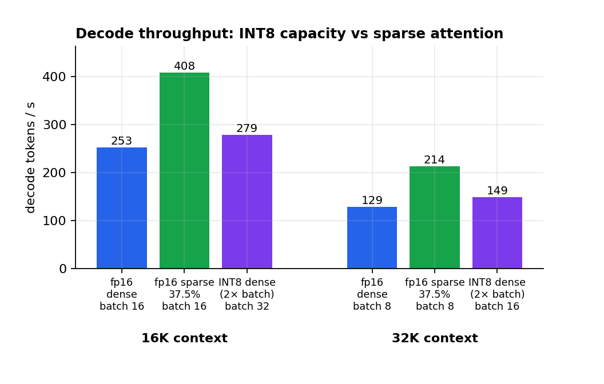

# LatentServe

LatentServe is an LLM inference engine I built from scratch to learn how serving works. It runs Qwen2.5-1.5B-Instruct on NVIDIA T4 GPUs, and I benchmarked it against vLLM on the same hardware.

On one T4 it decodes 1.05–3.3× faster than vLLM and prefills up to 9.6× faster. Its output distribution stays within about 1.7×10⁻⁵ KL of an fp32 reference.

## Against vLLM

| | LatentServe | vLLM | Gap |
| --- | ---: | ---: | ---: |
| Decode step, batch 1, 2K context | 16.7 ms | 17.5 ms | 1.05× |
| Decode step, batch 16, 16K context | 63.3 ms | 190.6 ms | 3.0× |
| Decode step, batch 8, 32K context | 62.2 ms | 198.0 ms | 3.2× |
| First token, 1K-token prompt | 131 ms | 271 ms | 2.1× |
| First token, 32K-token prompt | 16.9 s | 161.8 s | 9.6× |
| Burst throughput | 256 tok/s | 90 tok/s | 2.8× |
| Multi-turn chat, prefix caching on | 629 tok/s | 415 tok/s | 1.5× |
| Saturation, open-loop requests | 1.58 req/s | 0.50 req/s | 3.2× |

Both engines received the same prompts, concurrency limits and seeds.

Most of the gap is probably attention. A T4 cannot run FlashAttention-2, so vLLM falls back to a Triton kernel, and the gap grows with batch size and context, which is consistent with that explanation. I did not profile vLLM's kernel, so this is my best explanation rather than a measurement. At batch 1 with a short context, a step is dominated by reading the weights, and the two engines tie.







## Two GPUs

| Two T4s | LatentServe | vLLM |
| --- | ---: | ---: |
| Burst throughput, one GPU | 276 tok/s | 99 tok/s |
| Burst throughput, two replicas | 472 tok/s (1.71×) | 173 tok/s (1.76×) |
| Chat throughput, round-robin routing | 702 tok/s | 485 tok/s |
| Chat throughput, least-loaded routing | 759 tok/s (+8%) | 582 tok/s (+20%) |
| Per-token time at batch 1, model split across both GPUs | not built | 9.7 ms vs 16.8 ms on one (1.73×) |

These figures come from a separate set of runs, so the one-GPU numbers differ slightly from the table above.

Two replicas means one engine per GPU behind a router. The alternative is to split a single model across both GPUs (tensor parallelism), which only vLLM supports here. Replicas scaled to 85% of ideal for LatentServe and 88% for vLLM. One GPU is idle at the end of each run because the router balances request counts rather than work.

## What worked

- **The decode kernel.** The first version, written in Triton, reached only 69 GB/s on a card capable of about 320, because its math ran on the slow scalar path. The CUDA rewrite reaches 194 GB/s and is 2.8× faster, which reduced the decode step at batch 16 / 8K from 79 ms to 34 ms.
- **CUDA graphs.** A batch-1 step dropped from about 40 ms to 20–28 ms.
- **Prefix caching.** First-token time fell 72–84% on shared prompts and chat, at a cost of about 1% when nothing is shared.
- **An adaptive sparsity policy.** Choosing dense or sparse attention for each step came within 2% of always-sparse speed, at about half the expected answer loss.

## What didn't

- **Sparse attention below 50% of pages.** At 50% it is 1.40× faster at batch 8 / 32K and loses about 0.4% of answers. At 37.5% it is 1.66× faster and loses 1.2%. At 25% it loses 5.5% and fails the quality check. A perfect page selector loses nothing at 25% (tested up to 16K tokens), so the problem is choosing pages, not sparsity itself. A learned indexer would probably help; I have not tried one.
- **INT8 KV cache.** It holds 1.86× as many blocks but is never faster: level with dense at best, up to 12% slower at worst. Doubling the batch with INT8 gives 10–16% more throughput than fp16 dense, whereas sparse attention gives 62–66%.
- **MLA latent cache.** I dropped it after Phase 7. A latent that keeps value error at 10% compresses only about 1.6×, while INT8 gives 2× with no reconstruction work.



## Lessons

- Small test models hid a prefill bug for three phases (NaNs, and prefill twice as slow). The benchmark now refuses to time a model whose outputs are not finite.
- Running at real scale exposed bugs the tests never reached: admission ignored generated tokens, a sparse budget decayed inside graph buckets, and one-token requests crashed the engine.

## To do

- Rerun the comparison on an A10 or L4. Part of the gap is the T4, and how much is not yet known.
- Try a larger model. The 1.5B model cannot do multi-hop retrieval even with full attention, so sparse attention's effect on it is untested.
- Train a learned page indexer so sparse attention can go below 50%.
- Add tensor parallelism. vLLM's version gives 1.7× lower per-token latency on two T4s.
- Test with real prompts and varied output lengths. Everything here uses random tokens and fixed lengths, and the load curves are single runs, so individual points are noisy.

## Using it

```python
from kernels.gqa.paged_decode import set_decode_backend
from model.latentserve_qwen import LatentServeQwen
from model.qwen import QwenReference
from runtime.engine import ServingEngine
from runtime.request import ServedRequest

set_decode_backend("cuda")
ref = QwenReference(model_name="Qwen/Qwen2.5-1.5B-Instruct", dtype="fp16", device="cuda:0").load()
model = LatentServeQwen.from_reference(ref, max_seq_len_hint=8192,
                                       attn_impl="triton_paged", fuse_projections=True)
model.set_elementwise(True)

engine = ServingEngine(model, max_running=16, max_seq_len=8192, block_size=16,
                       use_cuda_graphs=True, prefix_caching=True)
engine.add_request(ServedRequest(request_id=0, prompt_ids=token_ids, max_new_tokens=128))
finished = engine.run()
```

Dense fp16 is the default. The opt-in features are `kv_dtype="int8"` on the engine, `model.set_sparse(0.5)` before building it, and `policy=SparsePolicy.from_json(table, tier="relaxed")` from `runtime.policy`. Decoding is greedy only, and there is no API server.

## Run it

```bash
pip install -r requirements.txt cupy-cuda13x vllm   # vllm only for the comparisons
export PYTHONPATH=$(pwd)
python -m benchmarks.runners.check_env
python -m pytest tests/ -q                          # GPU tests skip on CPU
python -m benchmarks.runners.sweep_stage1           # the full vLLM comparison; --report for tables
python -m benchmarks.make_figures                   # redraw docs/figures from the saved tables
```

Other experiments are in `benchmarks/runners/`, one per phase (`phase13_prefix`, `phase15_quality`, `phase17_*`, `phase18_*`). The T4 is compute capability 7.5, so everything runs fp16.

## Layout

```
model/        Qwen wrapper, decoder loop, GQA and sparse attention
cache/        paged KV cache, block allocator, INT8 and prefix caches
kernels/      Triton and CUDA decode kernels (CUDA via NVRTC and CuPy)
runtime/      engine, schedulers, CUDA-graph decoder, sparsity policy, router
benchmarks/   harness, one runner per phase, and the figure script
docs/         one note per phase, each opening with its outcome
```

The final sweep's tables are in `docs/sweep_stage1_results.md`. The plan I started from, including the hypotheses and the failure modes I expected, is in `docs/methodology.md`.
